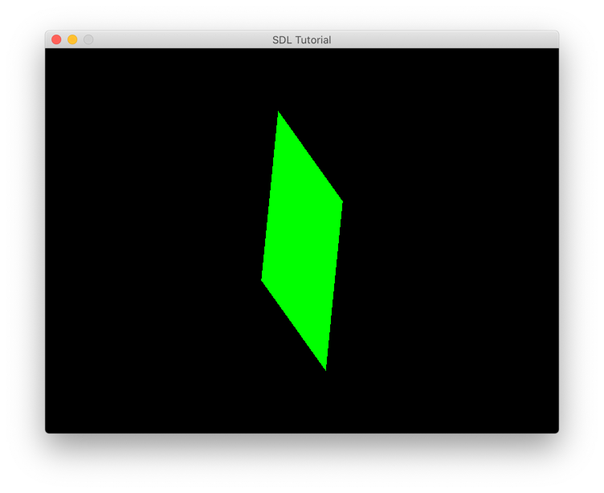
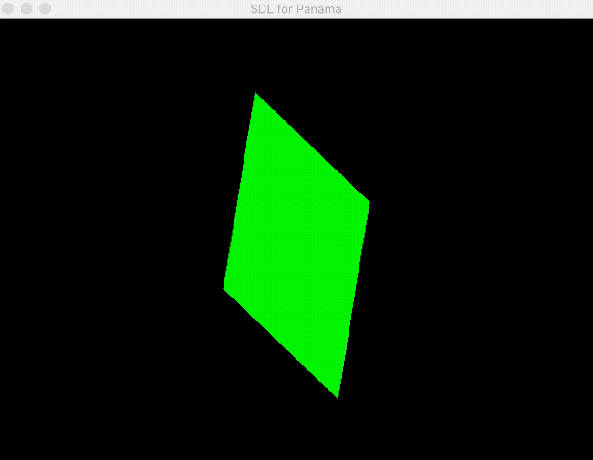
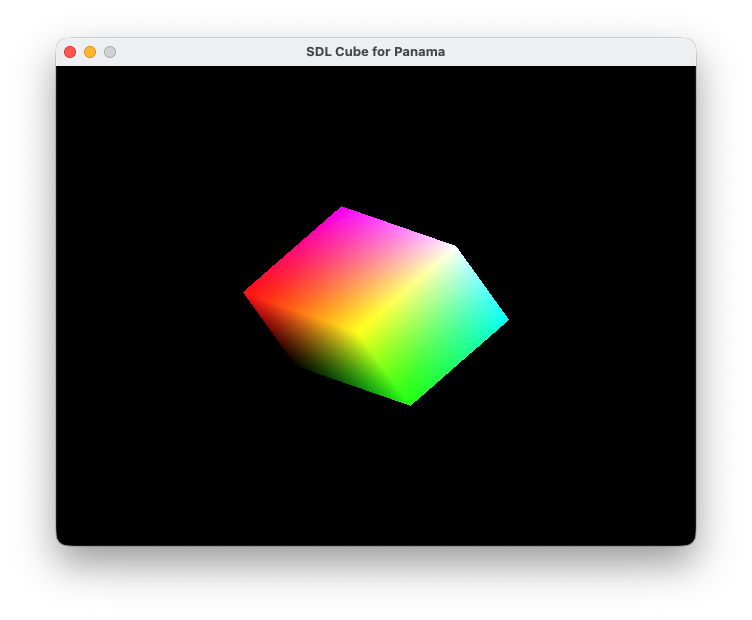
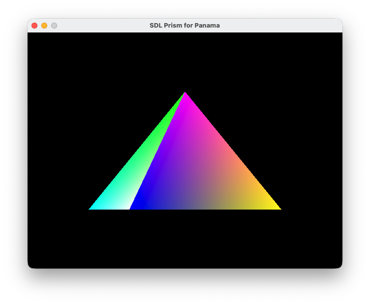

# Panama 4 Newbies
This is a quick intro to OpenJDK's Project Panama.
- Part 3  https://foojay.io/today/project-panama-for-newbies-part-3

## Requirements
- Simple DirectMedia Layer (SDL for short)
- OpenGL

Installing Simple DirectMedia Layer (SDL for short)
On MacOS arm64
```bash
brew install sdl2
```
Debian/Ubuntu (and related systems using apt or apt-get):
```bash
sudo apt update
sudo apt install libsdl2-dev
```
Fedora/CentOS (and related systems using dnf or yum):
```bash
sudo dnf install SDL2-devel
# or using yum:
sudo yum install SDL2-devel
```
Arch Linux (and related systems using pacman):
```bash
sudo pacman -S sdl2
```
Windows [MSYS sdl2](https://github.com/libsdl-org/SDL/blob/main/docs/INTRO-mingw.md):
Open the MSYS2 UCRT64 prompt and then ensure you've installed the following packages. This will get you working toolchain, CMake, Ninja, and of course SDL3.
```bash
pacman -S mingw-w64-ucrt-x86_64-gcc mingw-w64-ucrt-x86_64-ninja mingw-w64-ucrt-x86_64-cmake mingw-w64-ucrt-x86_64-sdl3
```
Or download zip file of the release at the following:
https://github.com/libsdl-org/SDL/releases/tag/release-3.2.28

## Part 3 - Learning Java Panama with 3rd party libraries
Clean up executables and generated code from jextract.
```bash
$ ./clean.sh
```
Compile basic examples using jextract with standard C libraries.
```bash
sh jextract_foo.h.sh
```

### Java Pid example using raw method handles (no jextract involved)
```shell
sh run_PanamaPid.java.sh
```
Output should be the following:
```shell
MethodHandle calling getpid() (16465)
Jextract's calling getpid()   (16465)
```

### Java Time example using jextract generated classes
```shell
sh run_PanamaTime.java.sh
```

Output should be the following:
```
1. Java DateTime from C time function: Wed Dec 31 16:04:25 EST 2025
2. C's printf & tm Struct of local time. 16:04:25
3. C's tm struct getters tm_hour, tm_min, tm_sec. 16:04:25
4. C's asctime() function to display date time: Wed Dec 31 16:04:25 2025
```


### C Example: Local time (Optional)
A C program demonstrating the use of time.h 

Compile  program (optional)
```shell
$ ./compile_local_time.c.sh
```

Run the local_time C program (optional)
```shell
$ ./local_time_exe
```

The output will show something similar as the following:
```
A C program to display local date time.
  Seconds since the epoch: 1629679836
  Local Time: Sun Aug 22 20:50:36 2021
```


### SDL Example: SDL Foo (Optional)
A CPP program demonstrating the use of the [SDL2](https://www.libsdl.org/) library
(a cross-platform development library designed to provide low level access to audio, keyboard, mouse, joystick, and graphics hardware via OpenGL and Direct3D).

Compile  program (optional)
```shell
$ ./compile_sdlfoo.cpp.sh
```

Run the SDL foo CPP program (optional)
```shell
$ ./sdlfoo_exe
```

The output will open a window with moving green flag.



Either close the window with the close button or by typing `q`.

### SDL & OpenGL Examples
A Java program that will call into SDL library.

Assuming you've already installed the SDL2 & opengl library.

Note this example leverages _Homebrew_ and the shell scripts relies on the paths
set up by homebrew, a different installation method is likely to require different paths. 

In order to run this example we need to make `jextract` generates the mappings 
for these two libraries
- `SDL.h`
- `SDL_opengl.h`

Use `jextract` tool to create the Java Source code and compile to the `classes` directory.
```shell
$ ./jextract_sdlfoo.h.sh
```

Run `SDLFoo.java`
```bash
$ ./run_SDLFoo.java.sh
```

You may notice the `-XstartOnFirstThread` option, this option is required on
macOs to run the `main()` method on the first (AppKit) thread.

The output is shown below:



Run `SDLCube.java`
```bash
$ sh run_SDLCube.java.sh
```

The contents of the file default to Mac's `DYLD_LIBRARY_PATH` environment variable.
Please change accordingly. If you are on a Linux OS you should use `LD_LIBRARY_PATH` instead, etc.
```bash
# MacOS Apple Silicon (homebrew installed)
export DYLD_LIBRARY_PATH=/opt/homebrew/lib/:$DYLD_LIBRARY_PATH

java -cp classes \
  -XstartOnFirstThread \
  --enable-native-access=ALL-UNNAMED \
  SDLCube
```
The output is shown below:




Run `SDLPrism.java`
```bash
$ sh run_SDLPrism.java.sh
```

The output is shown below:
